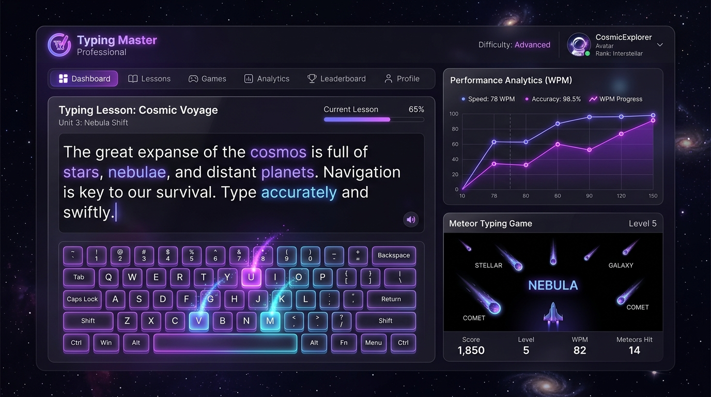

# ☄️ Typing Master Professional

An elegant, cosmic-themed interactive typing trainer web application. Improve your typing speed, accuracy, and muscle memory through gamified practice, personalized lessons, and a real-time responsive interface.

---

## 📸 Application Showcase

Here is a glimpse of the application's clean, modern, glassmorphism-infused dark visual design:



---

## 🌟 Highlighted Core Features

-   **🌌 Cosmic Dark Aesthetic**: Sleek glassmorphic panels, rich purple and violet color styling, and smooth transitions that minimize eye strain during long practice sessions.
-   **🎓 Modern Lesson Academy**: Interactive typing courses designed to teach hand patterns, finger ranges, and speed techniques.
-   **🤖 Gemini AI Speed Test Generator**: Supply any concept (e.g., *quantum computing*, *baking apple pie*) and target level difficulty for Gemini to instantaneously draft a custom typing test paragraph tailored to you.
-   **⌨️ Real-Time Virtual Keyboard**: Fully responsive keyboard feedback matching your typing live, complete with neon visual finger positions matching each standard character.
-   **🕹️ Arcade Meter Typing Game (Meteor Storm)**: Defend your station against descending meteors by typing letters quickly to blast them out of orbit.
-   **📊 Analytics Velocity Sparkline**: Embedded custom SVG sparklines plotting real-time typing speed trajectories, accuracy averages, and practice tracking over consecutive sessions.

---

## 🛠️ Local Development & Running the App

### 1. Prerequisites
Ensure you have **Node.js (v18+)** installed.

### 2. Environment Setup
Configure a `.env` file at the root. You can copy the example file:
```bash
cp .env.example .env
```
Provide your **Gemini API Key**:
```env
GEMINI_API_KEY=your_gemini_api_key_here
```

### 3. Install Dependencies
```bash
npm install
```

### 4. Run Development Server
```bash
npm run dev
```
The application will launch on `http://localhost:3000`.

---

## 📦 Production Bundling & Deployment

The application features a robust double-engine build structure configured inside `package.json`:
-   **Frontend Bundle**: Generates static client files in `dist/`.
-   **Backend Server Bundle**: Packages the Express API server (which proxies Gemini API calls safely) in standard Node.js via esbuild.

To execute a local production test:
```bash
# Compile both the static assets and backend CJS bundle
npm run build

# Boot up the server locally
npm run start
```

---

## 🚀 Deploing the App to GitHub Pages (Static Frontend Hosting)

GitHub Pages is a static asset hosting provider. Because it only delivers static HTML, CSS, and JS files, **the backend server (`server.ts`) will not run directly on GitHub Pages**. 

When deployed statically to GitHub Pages, the core app (lessons, games, analytics graphs, custom typing tests) runs flawlessly offline. If you trigger the AI Prompt Generator, the client gracefully falls back to preset typing lessons, reporting a clean message.

Here are the step-by-step instructions to configure, build, and deploy the client to GitHub Pages:

### Step 1: Add a Base Path in `vite.config.ts`
Vite needs to know your repository name to resolve asset paths correctly on GitHub Pages (since files are hosted at `https://<username>.github.io/<repo-name>/`).

Open `vite.config.ts` and modify your config block to include the `base` path:
```typescript
import { defineConfig } from 'vite'
import react from '@vitejs/plugin-react'

// Replace 'typing-master-pro' with your actual GitHub repository name
export default defineConfig({
  plugins: [react()],
  base: '/typing-master-pro/', // <-- Add this line
  server: {
    port: 3000
  }
})
```

---

### Step 2: Install the `gh-pages` Package
In your project directory, install the deployment tool:
```bash
npm install gh-pages --save-dev
```

---

### Step 3: Add Deploy Scripts in `package.json`
Open your `package.json` and insert `"predeploy"` and `"deploy"` commands into the `"scripts"` block:
```json
"scripts": {
  "dev": "tsx server.ts",
  "build": "vite build && esbuild server.ts --bundle --platform=node --format=cjs --packages=external --sourcemap --outfile=dist/server.cjs",
  "start": "node dist/server.cjs",
  "lint": "tsc --noEmit",
  "predeploy": "vite build",
  "deploy": "gh-pages -d dist"
}
```
> *Note: We use `vite build` directly for `predeploy` to create the static bundle in `/dist/` specifically for static hosting, skipping the server bundling step.*

---

### Step 4: Deploy the Client App
Run the deployment script. This compiles the static client and pushes the contents of `/dist/` to a dedicated `gh-pages` branch on GitHub:
```bash
npm run deploy
```

---

### Step 5: Configure GitHub Settings
1. Go to your repository page on **GitHub**.
2. Click on **Settings** > **Pages** (in the sidebar).
3. Under **Build and deployment**, ensure the **Source** is set to **Deploy from a branch**.
4. Set the branch to `gh-pages` and folder to `/ (root)`.
5. Save the configuration. Your application will be live at:
   `https://<your-github-username>.github.io/<your-repository-name>/`

---

## ⚡ Handling the Backend & Gemini AI on GitHub Pages

If you want to access the custom **Gemini AI Dynamic Generator** on your published website instead of relying on the local static fallback, choose one of these two professional architectures:

### Modern Option A: Deploy the Full-Stack app to Cloud Run/Render/Railway
Platforms like **Google Cloud Run**, **Vercel**, **Render**, or **Railway** support full Node.js servers. 
- You can deploy the entire repository using the workspace's pre-configured `npm run build` and `npm run start` commands.
- Provide `GEMINI_API_KEY` in the hosting environment variables, and the API calls will work seamlessly at the root level!

### Modern Option B: Split Frontend (GitHub Pages) + Backend (Vercel Serverless / Render)
1. Deploy the client static site to **GitHub Pages** as shown above.
2. Deploy the single backend file `server.ts` to a hosting platform like **Render** or **Vercel API routes** with the `GEMINI_API_KEY` secret.
3. Edit `src/App.tsx` and update the fetch location to use your deployed API URL:
   ```typescript
   // Inside src/App.tsx (Change from local endpoint to external endpoint)
   const response = await fetch("https://your-backend-api.onrender.com/api/generate-prompt", {
     method: "POST",
     ...
   });
   ```
4. Remember to allow CORS on the backend server for your GitHub Pages origin.
